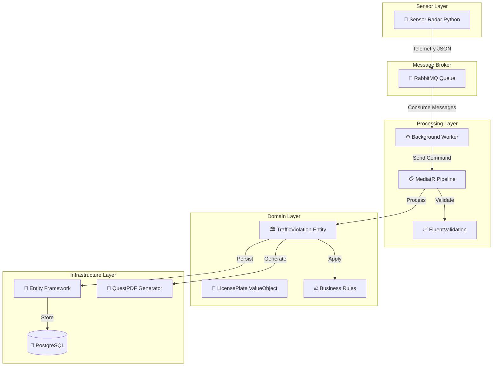

<div align="center">

</div>

<h1 align="center">🚦 TrafficGuard: Sistema Distribuído de Ingestão e Processamento de Infrações</h1>

<p align="center">
  
  
  
  
  
  
  
  
  
  
</p>

# 🎯 Sobre o Projeto

O **TrafficGuard** é um sistema distribuído moderno para **monitoramento inteligente de tráfego** e **processamento automatizado de infrações de velocidade**. Desenvolvido com arquitetura orientada a eventos, o sistema simula um ambiente real de radares de velocidade conectados que processam dados de telemetria em tempo real.

O projeto implementa um fluxo completo desde a **captura de dados por sensores simulados** até a **geração automática de multas em PDF**, passando por validação de regras de negócio, cálculo de penalidades e persistência de dados.

## 🏗️ Arquitetura do Sistema

O sistema foi projetado seguindo os princípios da **Clean Architecture** e **Domain-Driven Design (DDD)**, garantindo alta coesão, baixo acoplamento e facilidade de manutenção.



## 🚀 Funcionalidades

- [x] **Simulação de Radar**: Sensor Python que gera dados de telemetria realistas
- [x] **Processamento Assíncrono**: Worker em background consumindo mensagens via RabbitMQ
- [x] **Validação de Placas**: Value Object com regex para placas brasileiras (Mercosul)
- [x] **Cálculo Inteligente de Multas**: Baseado em percentual de excesso de velocidade
- [x] **Geração de PDFs**: Relatórios automáticos de multas com layout profissional
- [x] **Persistência Robusta**: Entity Framework Core com PostgreSQL
- [x] **Logs Estruturados**: Rastreamento completo do fluxo de processamento
- [x] **Containerização**: Docker Compose para ambiente completo

## 📊 Regras de Negócio

O sistema implementa as **regras oficiais do Código de Trânsito Brasileiro** para cálculo de multas por excesso de velocidade:

<table>
<thead>
<tr>
<th>Excesso de Velocidade</th>
<th>Classificação</th>
<th>Valor da Multa</th>
<th>Pontos na CNH</th>
</tr>
</thead>
<tbody>
<tr>
<td>Até 20%</td>
<td>Média</td>
<td>R$ 130,16</td>
<td>4 pontos</td>
</tr>
<tr>
<td>20% a 50%</td>
<td>Grave</td>
<td>R$ 195,23</td>
<td>5 pontos</td>
</tr>
<tr>
<td>Acima de 50%</td>
<td>Gravíssima</td>
<td>R$ 880,41</td>
<td>7 pontos</td>
</tr>
</tbody>
</table>

### 🧮 Exemplo de Cálculo

```csharp
// Limite: 60 km/h | Velocidade Medida: 85 km/h
double percentageOver = (85.0 / 60.0) - 1.0; // = 0.416 (41.6%)

// Como 41.6% está entre 20% e 50%:
// Classificação: Grave
// Multa: R$ 195,23
```

## 🛠️ Stack Tecnológica

### Backend (.NET)
- **Framework**: .NET 10 com C# 12
- **Arquitetura**: Clean Architecture + DDD
- **Padrões**: CQRS com MediatR, Repository Pattern
- **Validação**: FluentValidation
- **ORM**: Entity Framework Core
- **Banco**: PostgreSQL 17

### Messaging & Processing
- **Message Broker**: RabbitMQ 3
- **Background Service**: .NET Hosted Service
- **Serialização**: Newtonsoft.Json

### Sensor Simulation
- **Linguagem**: Python 3.12+
- **Biblioteca**: Pika (RabbitMQ Client)
- **Dados**: Geração aleatória com pesos realistas
- **Versão Pika**: 1.3.2 (RabbitMQ Client)

### Reports & Infrastructure
- **PDF Generation**: QuestPDF 2025.7.4
- **Validação**: FluentValidation 12.1.1
- **CQRS**: MediatR 14.0.0
- **Serialização**: Newtonsoft.Json 13.0.4
- **Containerização**: Docker & Docker Compose
- **Logs**: Microsoft.Extensions.Logging

## 🚀 Como Executar

### Pré-requisitos
- Docker & Docker Compose
- .NET 10 SDK
- Python 3.12+

### 1. Subir a Infraestrutura

```bash
# Clone o repositório
git clone <repository-url>
cd TrafficGuard

# Suba RabbitMQ e PostgreSQL
docker-compose up -d
```

### 2. Executar o Worker .NET

```bash
cd TrafficGuard.Worker
dotnet restore
dotnet run --project src/TrafficGuard.Worker
```

### 3. Iniciar o Sensor Python

```bash
# Instalar dependências
pip install pika

# Executar sensor
cd SensorRadar
python sensor.py
```

### 4. Monitorar o Sistema

- **RabbitMQ Management**: http://localhost:15672 (admin/admin123)
- **Logs do Worker**: Console da aplicação .NET
- **PDFs Gerados**: Pasta `Multas_Geradas/`

## 📄 Exemplos de Multas Geradas

O sistema gera automaticamente multas em PDF com layout profissional. Confira alguns exemplos na pasta `Examples/`:

- `Multa_ABC1044_545_639008927941380385.pdf` - Multa por excesso de velocidade (Placa ABC1044)
- `Multa_ABC1434_543_639008927800526503.pdf` - Multa por excesso de velocidade (Placa ABC1434)
- `Multa_ABC1728_449_639008922101694091.pdf` - Multa por excesso de velocidade (Placa ABC1728)


*Os PDFs contêm todas as informações necessárias: dados do veículo, detalhes da infração, cálculo da penalidade e valor da multa conforme o CTB.*

## 📁 Estrutura do Projeto

```
TrafficGuard/
├── 📁 SensorRadar/
│   └── sensor.py                    # Simulador de radar em Python
├── 📁 TrafficGuard.Worker/
│   ├── 📁 src/
│   │   ├── 📁 TrafficGuard.Domain/      # Entidades e regras de negócio
│   │   ├── 📁 TrafficGuard.Application/ # Casos de uso e DTOs
│   │   ├── 📁 TrafficGuard.Infrastructure/ # Persistência e relatórios
│   │   └── 📁 TrafficGuard.Worker/      # Background service
│   └── TrafficGuard.sln
├── 📁 Examples/                     # PDFs de exemplo gerados
├── docker-compose.yml               # Infraestrutura containerizada
└── README.md
```

## 🔄 Fluxo de Dados

1. **Captura**: Sensor Python simula leitura de radar e envia telemetria
2. **Enfileiramento**: Dados são publicados na fila RabbitMQ
3. **Consumo**: Worker .NET consome mensagens assincronamente
4. **Validação**: FluentValidation verifica integridade dos dados
5. **Processamento**: MediatR orquestra o comando de processamento
6. **Domínio**: Entity aplica regras de negócio e calcula penalidades
7. **Persistência**: Entity Framework salva no PostgreSQL
8. **Relatório**: QuestPDF gera multa em PDF automaticamente

## 🎯 Próximos Passos

- [ ] **API REST**: Endpoint para consulta de multas
- [ ] **Imagens**: Detecção de placas via imagens
- [ ] **Dashboard Web**: Interface para monitoramento em tempo real
- [ ] **Notificações**: Integração com email/SMS para proprietários
- [ ] **Machine Learning**: Detecção de padrões de tráfego
- [ ] **Testes Automatizados**: Cobertura completa com xUnit
- [ ] **Observabilidade**: Métricas com Prometheus + Grafana

## 👨‍💻 Autor

**Arthur Bomfim** - Desenvolvedor Backend
---

<div align="center">
<p><em>Sistema desenvolvido para demonstrar competências em arquitetura distribuída, processamento assíncrono e aplicação de regras de negócio complexas.</em></p>
</div>
