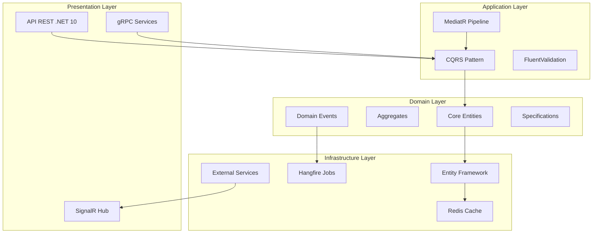

<h1 align="center">🚦 TrafficGuard: Sistema Distribuído de Ingestão e Processamento de Infrações</h1>

  
  
  
  
  
  
  
  
  
  

<table> <thead> <tr> <th>Categoria</th> <th>Pacote</th> <th>Versão</th> <th>Propósito</th> </tr> </thead> <tbody> <tr> <td><strong>Arquitetura</strong></td> <td>MediatR</td> <td>12.2.0</td> <td>Padrão Mediator/CQRS</td> </tr> <tr> <td><strong>Validação</strong></td> <td>FluentValidation</td> <td>11.8.0</td> <td>Validação de comandos e DTOs</td> </tr> <tr> <td><strong>Mapeamento</strong></td> <td>AutoMapper</td> <td>12.0.1</td> <td>Transformação entre objetos</td> </tr> <tr> <td><strong>Documentação</strong></td> <td>Swashbuckle.AspNetCore</td> <td>6.6.1</td> <td>Documentação Swagger/OpenAPI</td> </tr> <tr> <td><strong>Processamento</strong></td> <td>Tesseract</td> <td>5.2.0</td> <td>OCR para leitura de placas</td> </tr> <tr> <td><strong>Imagens</strong></td> <td>OpenCvSharp</td> <td>4.9.0</td> <td>Processamento de imagens</td> </tr> <tr> <td><strong>Jobs</strong></td> <td>Hangfire</td> <td>1.8.6</td> <td>Processamento em background</td> </tr> <tr> <td><strong>Monitoramento</strong></td> <td>Serilog</td> <td>3.1.1</td> <td>Logs estruturados</td> </tr> </tbody> </table>
